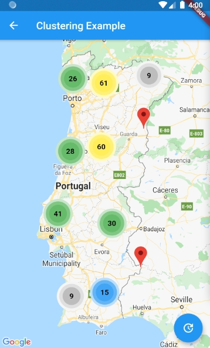

# Flutter google maps clustering sample

A new Flutter project.

- [Portugal prominent Cities Database](https://simplemaps.com/data/pt-cities)
- [Flutter Package: Clustering for Flutter Google Maps](https://pub.dev/packages/clustering_google_maps)

